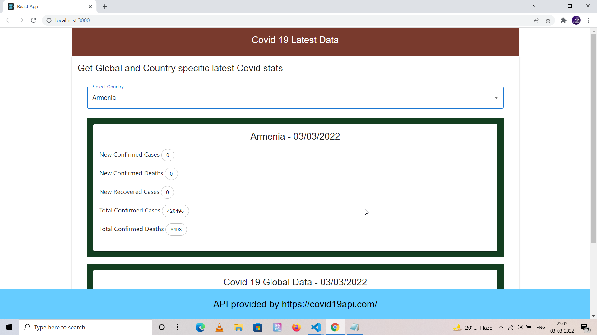
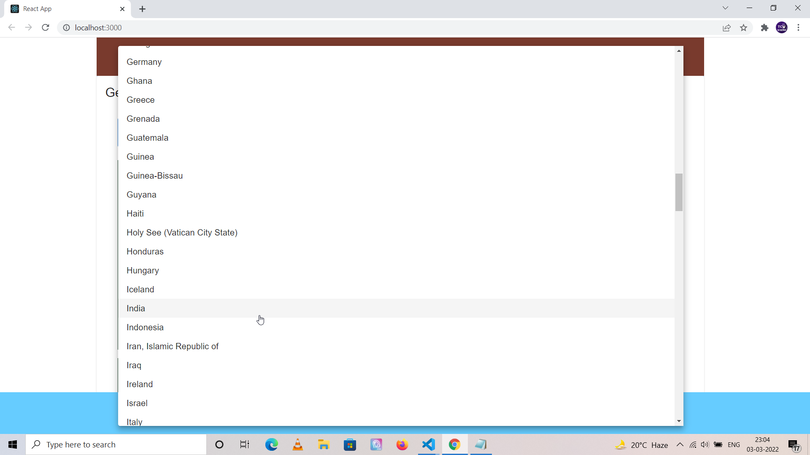

<h3 align="center">
  Covid 19 Update App in React
</h3>

## Overview

- **Made in React.** A progressive modern front-end Javascript framework to build blazing fast SPA applications.

- **Covid 19 API.** Uses API from this website https://covid19api.com/, might have a rate limit but no key is required to access the end-point at the time of writing this.

- **Material UI** It makes use of React Material components for form and card elements used in the application.

## Development Setup

Please install node modules through npm install command, contains separate front-end and back-end sections.

```
npm install

// For making a build and deploying for production
npm run build

// For development
npm start

```

## Future improvements

- Little to no scope of including anything else in this project as it is a simple API integration based application.

- Might add deployment scripts to deploy on Heroku, Netlify and through Docker on personal server.

## Project Screenshots

There isn't a lot of scope of adding screenshots for this project as it only contains a single page. First part of the homepage is depicted below which shows country specific Covid data.



Second part of the first page which shows how Global data is displayed which is basically similar to how country data is shown.


List of countries to choose from the dropdown



## Estimated Completion Time

The project is expected to be completed in around 4 hours. Most of the time was spent of flexing the UI until I was satisfied :)
